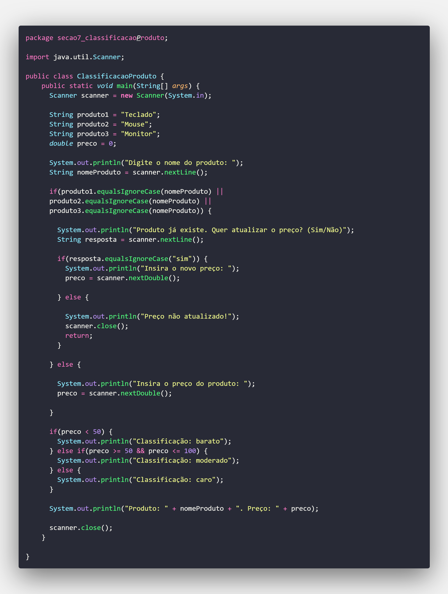

# 🧮 Classificação de Produto em Java

Bem-vindo ao projeto **Classificação de Produto**! Este é um aplicativo simples desenvolvido em **Java** que permite verificar os preços dos itens e atualizar os valores do produtos com base nas informações cedidas pelo usuário.

## 🚀 Sobre o Projeto

Este projeto tem como objetivo principal demonstrar o uso básico de entrada de dados em Java utilizando a biblioteca `java.util.Scanner`. Ele serve como um ótimo exemplo para iniciantes que estão aprendendo lógica de programação, estrutura condicional e manipulação de entrada/saída no console.

## 💡 Funcionalidades

- Leitura de dados do usuário (nome do produto);
- Exibição do resultado do produto;

## 🛠️ Tecnologias Utilizadas

- Linguagem: **Java**
- Biblioteca padrão: `java.util.Scanner`

## 📥 Como Executar

1. **Clone o repositório:**
   ```bash
   git clone https://github.com/DevRafaSantos/ClassificacaoProduto.git
   ```
2. **Compile o código:**
   ```bash
   javac ClassificacaoProduto.java
   ```
3. **Execute o programa:**
   ```bash
   java ClassificacaoProduto
   ```
## 🖼️ Imagens do Projeto

### 📌 Trecho do Código


## 📸 Exemplo de Uso

```plaintext
Digite o nome do produto: Teclado
Produto já existe. Quer atualizar o preço? (sim/não): Sim
Insira o novo preço: 23
Classificação: Barato
Produto: Teclado. Preço: 23.0

Digite o nome do produto: Teclado
Produto já existe. Quer atualizar o preço? (sim/não): Não
Preço não atualizado!
```

## 📚 Aprendizados

Este projeto me permitiu:

- Praticar entrada e saída de dados em Java;
- Entender melhor estruturas condicionais;
- Trabalhar com operações matemáticas;
- Aprender boas práticas de documentação.

## 🤝 Contribuições

Contribuições são bem-vindas! Se você quiser sugerir melhorias, abrir issues ou criar um pull request, fique à vontade!

---

📌 **Desenvolvido com dedicação e curiosidade 💻 por Rafael Santos**
